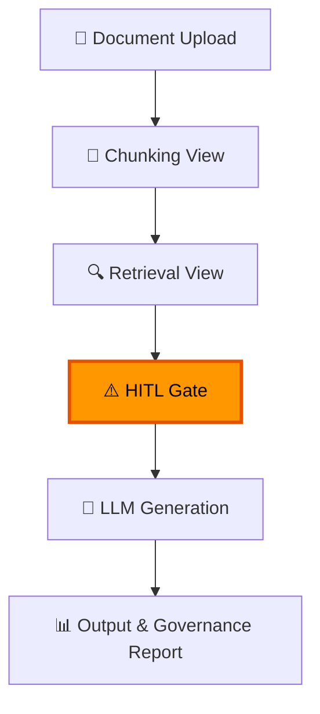
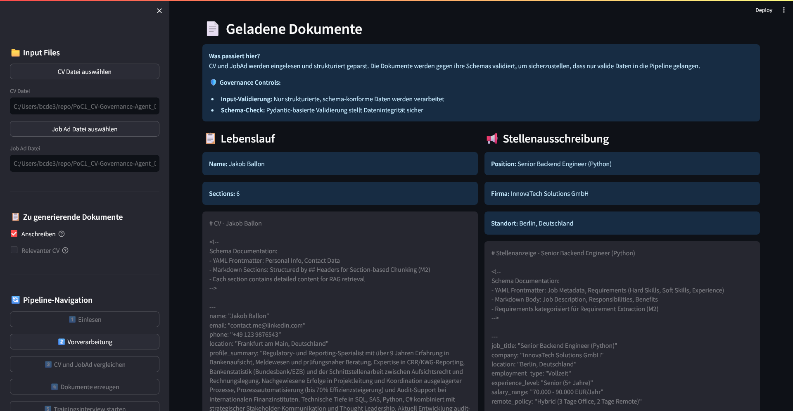
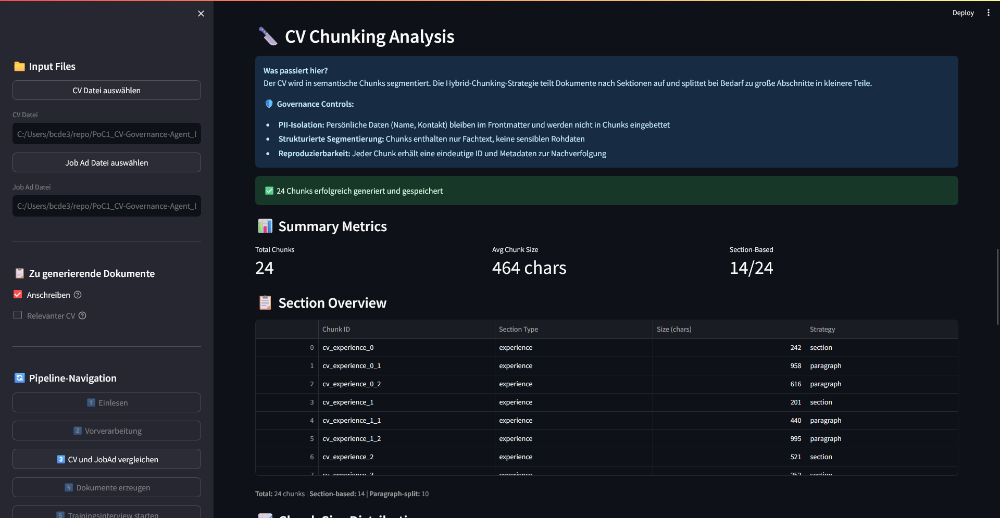
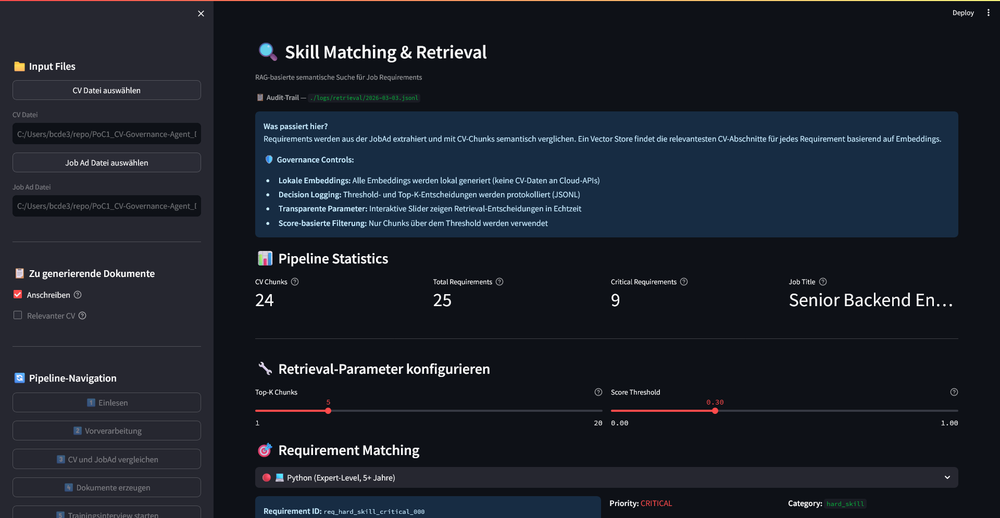
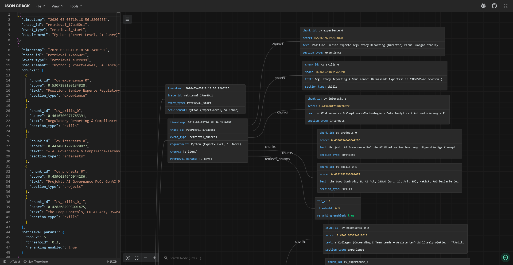
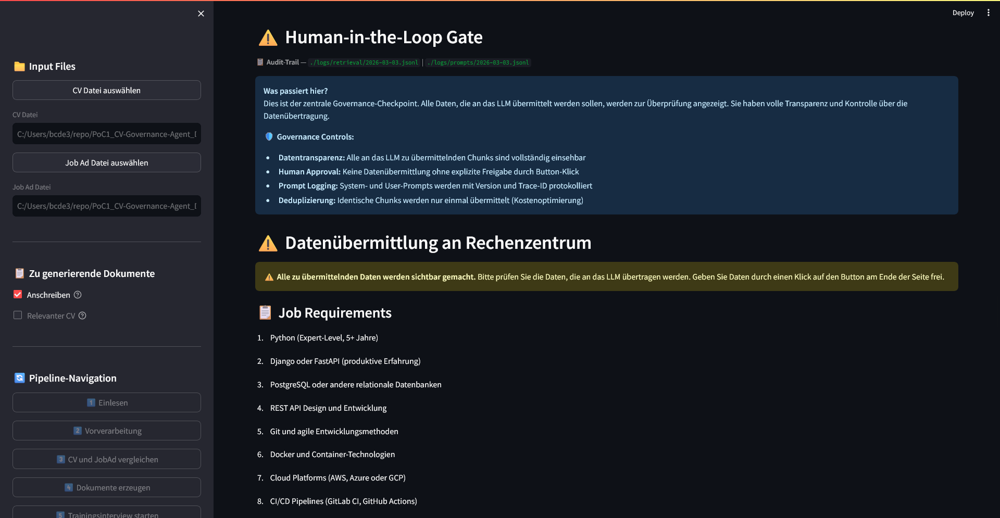
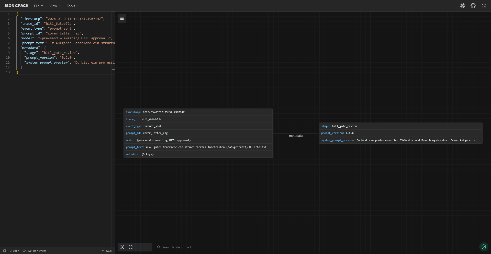
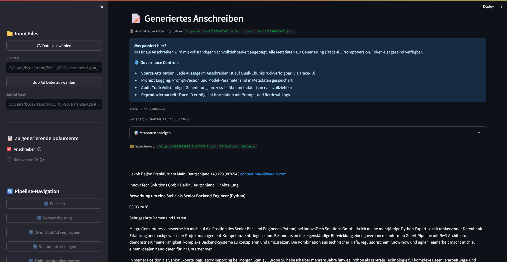
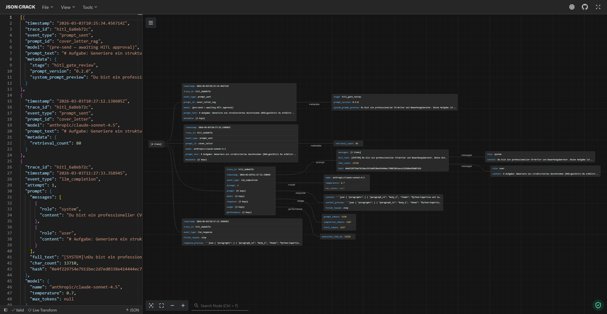
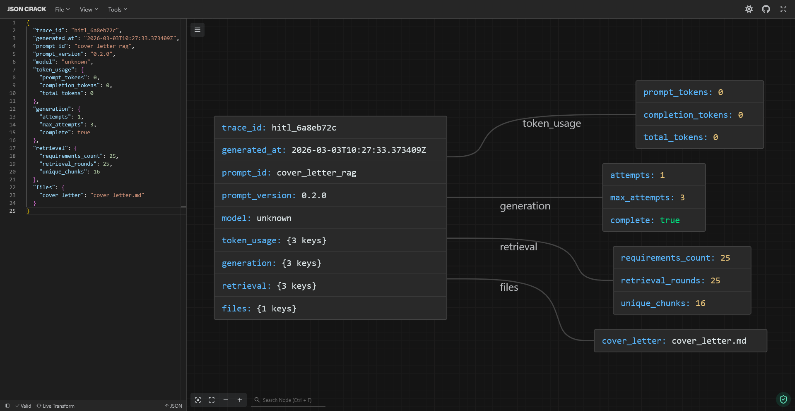

# AI Governance PoC: GenAI Document Pipeline

[](https://www.python.org/)
[](https://streamlit.io/)
[](https://www.deeplearning.ai/short-courses/building-evaluating-advanced-rag/)
[](https://artificialintelligenceact.eu/)
[](LICENSE)

🇩🇪 [Deutsche Version](README.md)

> **From document input to controlled output: A single-agent pipeline demonstrating that governance is not a blocker for GenAI — but an enabler for regulated industries.**

- [Introduction](#ai-governance-poc-genai-document-pipeline)
- [Interactive Demo](#interactive-demo)
- [Governance Controls in Detail](#governance-controls-in-detail)
- [Regulatory Compliance Mapping](#regulatory-compliance-mapping)
- [Tech Stack](#tech-stack)
- [Installation / Quick Start](#quick-start)
- [Project Structure](#project-structure)
- [Further Documentation](#further-documentation)
- [Contact & Licence](#contact--licence)

**LinkedIn:** [Jakob Simon Ballon](https://www.linkedin.com/in/jakob-simon-ballon-90927b3b2/) — Demo requests welcome!

## The Problem

Generative AI in regulated industries typically fails not because of technical infeasibility, but due to **three governance gaps**:

| Governance Gap | Risk | Consequence |
|----------------|------|-------------|
| ❌ **Hallucinations** | LLMs fabricate content without factual basis | Unacceptable in credit assessment, KYC, compliance |
| ❌ **Lack of data control** | Unclear which data flows where | Problematic for PII, MNPI, confidential documents |
| ❌ **No traceability** | No audit trail, no source references | Incompatible with MaRisk, EU AI Act, GDPR |

**Result:** Compliance departments block GenAI initiatives — justifiably so.

## The Solution

This PoC demonstrates how these gaps can be **systematically closed**:

### **1. Hallucination Prevention**
- **Evidence-Based Generation**: Every statement in the output is traceable to a source in the input document via backlinks
- **Confidence Scoring**: Automatic quality assessment of every generated text passage
- **Source Attribution**: Inline citations in the format `[Source: chunk_id, Score: 0.87]`

### **2. Context Control**
- **RAG-based information selection**: Only relevant chunks are passed to the LLM
- **Local Embeddings**: sentence-transformers (local) — no CV data sent to cloud APIs
- **Threshold-based Retrieval**: Controlled information volume, no data flooding

### **3. Full Data Control**
- **HITL Gate**: Human-in-the-Loop transparency gate before any data is transmitted to the LLM API
- **Chunk Review**: All data visually inspectable, explicit approval required
- **PII Isolation**: Raw PII (name, contact) stays in frontmatter; only professional content enters the prompt

### **4. Regulatory Auditability**
- **Prompt Versioning**: Git-based management of all LLM prompts (`prompts/v0.2.0/`)
- **Structured Logging**: Complete audit trail (Prompt Logs, Retrieval Logs, Events)
- **Reproducibility**: Same inputs + same prompt version = verifiable result


## Demo Use Case: CV + Cover Letter

**Why this use case?**
- ✅ **Universally understood**: Everyone knows job application documents — no domain knowledge required
- ✅ **Governance-relevant**: PII data, source chaining, hallucination risk — all present
- ✅ **Quickly demonstrable**: 30 sec. upload → 60 sec. generation → immediate review
- ✅ **Transferable**: Identical pattern to KYC/AML, credit assessment, instrument mapping

## Transferable Use Cases (Financial Services)

| Use Case | Input Documents | Output | Governance Requirement |
|----------|-----------------|--------|------------------------|
| **Internal & External Reports** | Analyses, data points | Document, report | Traceability to underlying figures |
| **Instrument Mapping** | Product factsheets, annual reports | Sector classification | Source evidence for every classification |
| **KYC/AML Pre-Screening** | Customer data, sanctions lists | Review report | No MNPI/PII accidentally in reports |
| **Credit Assessment** | Business plans, JV contracts | Credit analysis | Controlled processing of confidential documents |
| **Contract Analysis** | Legal documents | Risk summary | Traceability to original clauses |

**Core message:** Same governance patterns, different documents.

---

# Interactive Demo

**6-Stage Pipeline** with governance controls at every level:



> 💡 **Tip:** Click on individual steps in the diagram to jump to the detailed descriptions.


## Pipeline Details

### 1. 📄 Document Upload

**Input Format:**
- **Structured Markdown** (CV.md, JobAd.md) with YAML frontmatter
- **Schema Validation** via Pydantic Models (type-safe parsing)
- **Required fields**: Name, Contact (CV) / Title, Requirements (JobAd)


_(Streamlit — Upload View)_

**Governance Controls:**
- ✅ Only schema-compliant inputs are accepted
- ✅ Validation prevents faulty data from entering subsequent stages
- ✅ Error messages on parsing problems (e.g. missing frontmatter)

**Technical Details:**
- Parser: `src/parsers/cv_parser.py`, `src/parsers/job_parser.py`
- Models: `src/models/cv.py`, `src/models/job_ad.py`
- Error handling: Clear validation errors with line numbers


### 2. 🔪 Chunking View

**Chunking Strategy:**
- **Hybrid Chunker**: Section-based (Education, Experience) + paragraph-split (for long sections)
- **Metadata Tagging**: Each chunk receives section info, skills tags, PII flags
- **Chunk Size Control**: Max. 500 tokens, min. 50 tokens (configurable)


_(Streamlit — Chunking View)_

**Governance Controls:**
- ✅ **PII Isolation**: Raw PII (name, email, phone) stays in frontmatter metadata
- ✅ Chunks contain only professional content (skills, experience, projects)
- ✅ Prevents context loss via paragraph splits

**Visualisation:**
- Chunk Size Distribution (histogram)
- Section Overview (table: Chunk ID, Section, Token Count, Strategy)
- Expandable Chunk Details (text preview + metadata)

**Technical Details:**
- Implementation: `src/rag/chunker.py` (HybridChunker)
- UI View: `src/ui/chunking_view.py`


### 3. 🔍 Retrieval View

**Requirement Extraction:**
- **From JobAd**: Automatic extraction of skills, qualifications, experience
- **Structuring**: `{requirement_text, category, importance}` (JSON)
- **Embedding**: sentence-transformers (local, no cloud API)

**Vector Similarity Search:**
- **Top-K Retrieval**: Default Top-5 (configurable 1–10)
- **Score Threshold**: Min. 0.6 (adjustable 0.4–0.9)
- **Scoring**: Cosine Similarity (scipy)


_(Streamlit — Retrieval View)_

**Governance Controls:**
- ✅ **Decision Logging**: Threshold, Top-K, retrieved chunks logged (JSONL)
- ✅ **Local Embeddings**: No CV data sent to external embedding APIs
- ✅ **Insufficient Evidence Warnings**: When score < 0.6


_(JSON Crack render — Retrieval Logs)_

**Visualisation:**
- Requirement selection dropdown
- Score visualisation: 🟢 High (>0.8), 🟡 Medium (≥0.6), 🔴 Low (<0.6)
- Chunk preview (text + score + source section)

**Technical Details:**
- Implementation: `src/rag/requirement_extractor.py`, `src/rag/retriever.py`
- UI View: `src/ui/retrieval_view.py`


### 4. ⚠️ HITL Gate — Data Approval

> **🔐 Core Feature: Human-in-the-Loop Transparency Gate**

**How it works:**
- **Transparency Gate**: "⚠️ The following data will be transmitted to the LLM data centre"
- **Chunk Grouping**: System Context (prompts), Requirements (JobAd), CV Data (retrieved chunks)
- **Explicit Approval**: Button-based ("Release data and proceed")


_(Streamlit — HITL Gate View)_

**Data Transparency:**
- All chunks visually inspectable (text + metadata + scores)
- PII overview (which personal data is included?)
- Token count & model info (GPT-4, Claude, etc.)

**Governance Controls:**
- ✅ **No data transmission without human approval**
- ✅ Data Minimisation: User can remove individual chunks
- ✅ Approval Log: Timestamp + User ID of the approval (for audit)


_(JSON Crack render — Prompt Logs pre LLM)_

**Why this gate is critical:**
- Prevents uncontrolled PII transmission
- Enables purpose-limitation checks (GDPR Art. 5)
- Creates transparency when using cloud LLMs

**Technical Details:**
- Implementation: `src/ui/hitl_gate_view.py`
- Logging: `logs/approvals.jsonl` (Approval Events)


### 5. 🤖 LLM Generation

**Evidence-Bound Generation:**
- **JSON Schema Prompt**: LLM generates structured JSON with chunk references
- **Constraint**: Every statement MUST reference a `source_chunk_id`
- **Output Format**: `{paragraph_text, source_chunks: [{chunk_id, relevance}]}`


_(Streamlit — Result View)_

**Governance Controls:**
- ✅ **Prompt Logging**: Full prompt text + version + model + parameters (JSONL)
- ✅ **Prompt Versioning**: Git-based (`prompts/v0.2.0/cover_letter_prompt.yaml`)
- ✅ **Evidence Binding**: Only provided chunks in context, no web search


_(JSON Crack render — Prompt Logs post LLM)_


_(JSON Crack render — Metadata)_

**Model Flexibility:**
- OpenRouter.ai supports GPT-4, Claude Sonnet, Llama, etc.
- Easy switch via `.env`: `DEFAULT_MODEL=anthropic/claude-4.5-sonnet`
- No vendor lock-in

**Technical Details:**
- Implementation: `src/services/generation_service.py`
- LLM Client: `src/llm/openai_client.py` (OpenRouter.ai compatible)
- Prompt Builder: `src/pipeline/prompt_builder.py`


### 6. 📊 Output + Governance Report

**Output Format:**
- **Markdown with Inline Citations**: `[Source: cv_exp_001, Score: 0.87]`
- **Source Traceability**: Statement → Chunk ID → Original CV section (clickable in UI)
- **Structured Sections**: Intro, Main Body, Closing (like a real cover letter)

**Governance Report (Parallel to Output):**
- **Confidence Metrics**: Average score, distribution, low-confidence flags
- **Coverage Report**: Which JobAd requirements were covered? (%)
- **Source Attribution**: Table (output segment → chunk → CV section)
- **Quality Flags**: Warnings for score <0.6, missing references, etc.

**Audit Trail:**
- **Output Metadata** (`outputs/*/metadata.json`):
  - Trace ID (correlatable with Prompt Logs, Retrieval Logs)
  - Prompt Version, Model Name, Timestamp
  - Source References (complete list)
- **Versioning**: Semantic versioning (v1.0.0, v1.1.0 on re-generation)

**Technical Details:**
- Implementation: `src/pipeline/cover_letter_renderer.py`, `src/pipeline/output_validator.py`
- UI View: `src/ui/output_view.py`, `src/ui/evidence_view.py`
- Storage: `src/pipeline/output_storage.py`

---

# Governance Controls in Detail

### Pipeline Stage → Control Mapping

| Pipeline Stage | Governance Control | What is ensured |
|----------------|--------------------|-----------------|
| **Input** | Schema Validation | Only structured, compliant data |
| **Chunking** | PII Isolation | Raw PII stays in frontmatter; only professional text in chunks |
| **Retrieval** | Decision Logging | Threshold and Top-K decisions logged (JSONL) |
| **Retrieval** | Local Embeddings | No CV data sent to cloud APIs |
| **HITL Gate** | Data Transparency | All chunks viewable before LLM submission |
| **HITL Gate** | Human Approval | No data transmission without explicit approval |
| **Generation** | Prompt Logging | Prompt version, model parameters, full text logged |
| **Generation** | Evidence Binding | LLM generates only from provided chunks |
| **Output** | Source Attribution | Inline citations link every statement to a source chunk |

### Logging Architecture

**Three log streams** (JSONL, append-only, correlatable via Trace ID):

1. **Prompt Logs** (`logs/prompts/`) — Prompt ID, version, full text, model, timestamp
2. **Retrieval Logs** (`logs/retrieval/`) — Query, retrieved chunks, scores, threshold
3. **Output Metadata** (`outputs/*/metadata.json`) — Trace ID, prompt version, source references

---

# Regulatory Compliance Mapping

| Regulation | Requirement | Implementation in this PoC |
|------------|-------------|---------------------------|
| **EU AI Act** | Transparency | ✅ Prompt versioning, retrieval logs, source attribution |
| **EU AI Act** | Human Oversight | ✅ HITL Gate before LLM submission, approval workflow |
| **EU AI Act** | Traceability | ✅ Complete audit trail (Trace ID, JSONL logs) |
| **GDPR** | Data Minimisation | ✅ Only relevant chunks sent to LLM (retrieval threshold) |
| **GDPR** | PII Control | ✅ PII isolation in chunks, transparent data flows |
| **GDPR** | Purpose Limitation | ✅ Explicit approval per processing purpose (HITL Gate) |
| **MaRisk AT 7.2** | Automated Processes | ✅ Control mechanisms (confidence scoring, HITL) |

---

# Tech Stack

| Component | Technology | Why |
|-----------|------------|-----|
| **RAG** | sentence-transformers | Local embeddings (no cloud data) |
| **Vector Search** | cosine_similarity (scipy) | Threshold-based retrieval |
| **LLM** | OpenRouter.ai (GPT-4, Claude) | Flexibly switchable, no vendor lock-in |
| **UI** | Streamlit | Rapid demo interface for pipeline inspection |
| **Logging** | Structured JSONL | Append-only, auditable, machine-readable |
| **Prompt Versioning** | Git (YAML) | Full change history, reproducibility |
| **Schema Validation** | Pydantic | Type-safe models (CV, JobAd, Output) |

---

# Quick Start

## Installation

```bash
# Create virtual environment
python -m venv .venv
.venv\Scripts\activate  # Windows
# source .venv/bin/activate  # Linux/Mac

# Install dependencies
pip install -r requirements.txt
```

## Configuration

```bash
# Configure API key
copy .env.example .env
# Then edit .env: OPENROUTER_API_KEY=your_key_here
```

**Model Flexibility** (easily switchable):
```env
DEFAULT_MODEL=openai/gpt-5.2              # GPT-5.2
DEFAULT_MODEL=anthropic/claude-sonnet-4.5 # Claude Sonnet
```

## Start Demo

```bash
# Streamlit Pipeline Controller
./run_streamlit.cmd
```

---

# Project Structure

```
PoC1_CV-Governance-Agent_Dev/
├── src/
│   ├── parsers/            # CV.md, JobAd.md parsers (Pydantic Models)
│   ├── rag/                # Chunker, Embedder, Retriever, Evidence Linker
│   ├── llm/                # OpenRouter.ai Client
│   ├── pipeline/           # ApplicationPipeline, PromptBuilder, OutputValidator
│   ├── services/           # DocumentService, GenerationService, RetrievalService
│   ├── ui/                 # Streamlit Views (Chunking, Retrieval, Evidence)
│   └── infrastructure/     # LoggingService, Audit Trail
├── prompts/
│   ├── v0.1.0/             # Initial Prompt Set
│   ├── v0.2.0/             # Current Prompts (System, Task, Detection)
│   └── README.md           # Prompt Changelog
├── logs/
│   ├── prompts/            # Prompt Execution Logs (JSONL)
│   └── retrieval/          # Retrieval Decision Logs (JSONL)
├── outputs/                # Generated Documents + Metadata
├── samples/                # Sample CV/JobAd Files
├── tests/                  # Unit & Integration Tests (pytest)
└── .memorybank/            # Detailed Project Documentation
    ├── projectBrief.md
    ├── productContext.md
    ├── governance.md
    └── systemPatterns.md
```

---

# Further Documentation

Further documentation available on request:
- **`projectBrief.md`** — Core message, problem statement, solution approach
- **`productContext.md`** — Pipeline architecture, trust mechanisms, demo flow
- **`governance.md`** — Risk-based requirements, audit trail, quality gates
- **`systemPatterns.md`** — Agent architecture, RAG patterns, logging patterns
- **`regulatory.md`** — EU AI Act, GDPR, NIST AI RMF, ISO 42001 mappings


---

# Contact & Licence

**Interested in governance-compliant GenAI for Financial Services?**

For a **demo request**, please reach out directly via LinkedIn:

- 🔗 **LinkedIn:** [Jakob Simon Ballon](https://www.linkedin.com/in/jakob-simon-ballon-90927b3b2/) — Demo requests welcome!
- 📄 **Licence:** © All Rights Reserved — Any use, reproduction, or distribution requires the express written permission of the rights holder.

---

<p align="center">
  <i>This PoC demonstrates that governance is not a blocker — but the enabler that brings GenAI into regulated industries.</i>
</p>
