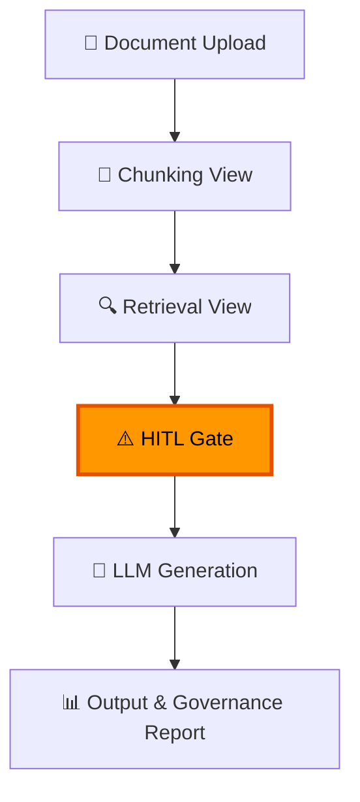

# AI Governance PoC: GenAI Pipeline

[](https://www.python.org/)
[](https://streamlit.io/)
[](https://www.deeplearning.ai/short-courses/building-evaluating-advanced-rag/)
[](https://artificialintelligenceact.eu/)
[](LICENSE)

> **Vom Dokument-Input bis zum kontrollierten Output: Eine Single-Agent-Pipeline, die zeigt, dass Governance kein Blocker für GenAI ist, sondern ein Enabler für regulierte Industrien.**

- [Einleitung](#ai-governance-poc-genai-pipeline)
- [Interaktive Demo](#interaktive-demo)
- [Governance Controls im Detail](#governance-controls-im-detail)
- [Regulatory Compliance Mapping](#regulatory-compliance-mapping)
- [Tech Stack](#tech-stack)
- [Quick Start](#quick-start)
- [Projektstruktur](#projektstruktur)
- [Weiterführende Dokumentation](#weiterführende-dokumentation)
- [Kontakt & Lizenz](#kontakt--lizenz)

**LinkedIn:** [Jakob Simon Ballon](https://www.linkedin.com/in/jakob-simon-ballon-90927b3b2/) — Demo-Anfragen willkommen!

[Gehe zu Installation](#installation--setup)

## Das Problem

Generative KI in regulierten Industrien scheitert typischerweise nicht an der technischen Machbarkeit, sondern an **drei Governance-Lücken**:

| Governance-Lücke | Risiko | Konsequenz |
|------------------|--------|------------|
| ❌ **Halluzinationen** | LLMs erfinden Inhalte ohne Faktenbasis | Inakzeptabel in Kreditprüfung, KYC, Compliance |
| ❌ **Fehlende Datenkontrolle** | Unklar, welche Daten wohin fließen | Problematisch bei PII, MNPI, vertraulichen Dokumenten |
| ❌ **Keine Nachvollziehbarkeit** | Kein Audit-Trail, keine Quellenreferenzen | Inkompatibel mit MaRisk, EU AI Act, DSGVO |

**Resultat:** Compliance-Abteilungen blockieren GenAI-Initiativen — berechtigt.

## Die Lösung

Dieser PoC demonstriert, wie diese Lücken **systematisch geschlossen** werden können:

### **1. Halluzinations-Prävention**
- **Evidence-Based Generation**: Jede Aussage im Output ist über Backlinks auf eine Quelle im Input-Dokument rückverfolgbar
- **Confidence Scoring**: Automatische Qualitätsbewertung jeder generierten Textpassage
- **Source Attribution**: Inline-Citations im Format `[Source: chunk_id, Score: 0.87]`

### **2. Kontextkontrolle**
- **RAG-basierte Informationsselektion**: Nur relevante Chunks werden an das LLM übergeben
- **Lokale Embeddings**: sentence-transformers (lokal) — keine CV-Daten an Cloud-APIs
- **Threshold-basiertes Retrieval**: Kontrollierte Informationsmenge, keine Datenflut

### **3. Volle Datenkontrolle**
- **HITL Gate**: Human-in-the-Loop Transparenz-Gate vor jeder Datenübermittlung an LLM-API
- **Chunk-Review**: Alle Daten visuell inspizierbar, explizite Freigabe erforderlich
- **PII-Isolation**: Roh-PII (Name, Kontakt) bleibt in Frontmatter, nur Fachtext im Prompt

### **4. Regulatorische Nachweisbarkeit**
- **Prompt Versioning**: Git-basierte Verwaltung aller LLM-Prompts (`prompts/v0.2.0/`)
- **Structured Logging**: Vollständiger Audit-Trail (Prompt Logs, Retrieval Logs, Events)
- **Reproduzierbarkeit**: Gleiche Inputs + gleiche Prompt-Version = nachvollziehbares Ergebnis


## Demo Use Case: CV + Anschreiben

**Warum dieser Use Case?**
- ✅ **Universell verständlich**: Jeder kennt Bewerbungsdokumente — kein Domänenwissen nötig
- ✅ **Governance-relevant**: PII-Daten, Quellenverkettung, Halluzinationsrisiko — alles vorhanden
- ✅ **Schnell demonstrierbar**: 30 Sek. Upload → 60 Sek. Generation → sofort Review
- ✅ **Übertragbar**: Identisches Muster wie KYC/AML, Kreditprüfung, Instrumenten-Mapping

## Übertragbare Use Cases (Financial Services)

| Use Case | Input-Dokumente | Output | Governance-Anforderung |
|----------|-----------------|--------|----------------------|
| **Interne & Externe Berichte** | Auswertungen, Datenpunkte | Dokument, Bericht | Rückverfolgbarkeit zum Zahlenwerk |
| **Instrumenten-Mapping** | Produkt-Flyer, Jahresberichte | Sektor-Zuordnung | Quellennachweis für jede Klassifikation |
| **KYC/AML Vor-Prüfung** | Kundendaten, Sanktionslisten | Prüfbericht | Keine MNPI/PII versehentlich in Reports |
| **Kreditprüfung** | Business Plans, JV-Verträge | Kreditanalyse | Vertrauliche Dokumente kontrolliert verarbeiten |
| **Vertragsanalyse** | Rechtsdokumente | Risiko-Summary | Rückverfolgbarkeit auf Original-Klauseln |

**Kernbotschaft:** Gleiche Governance-Patterns, andere Dokumente.

---

# Interaktive Demo

**6-Stufen Pipeline** mit Governance Controls auf jeder Ebene:



> 💡 **Tipp:** Klicke auf die einzelnen Schritte im Diagramm, um zu den detaillierten Beschreibungen zu springen.


## Pipeline Details

### 1. 📄 Document Upload

**Input-Format:**
- **Structured Markdown** (CV.md, JobAd.md) mit YAML Frontmatter
- **Schema Validation** via Pydantic Models (Type-Safe Parsing)
- **Pflichtfelder**: Name, Kontakt (CV) / Titel, Requirements (JobAd)


**Governance Controls:**
- ✅ Nur schema-konforme Inputs werden akzeptiert
- ✅ Validierung verhindert fehlerhafte Daten in nachfolgenden Stages
- ✅ Fehlermeldungen bei Parsing-Problemen (z.B. fehlendes Frontmatter)

**Technische Details:**
- Parser: `src/parsers/cv_parser.py`, `src/parsers/job_parser.py`
- Models: `src/models/cv.py`, `src/models/job_ad.py`
- Fehlerbehandlung: Klare Validation Errors mit Zeilennummer


### 2. 🔪 Chunking View

**Chunking-Strategie:**
- **Hybrid Chunker**: Section-based (Education, Experience) + Paragraph-split (bei langen Sections)
- **Metadata-Tagging**: Jeder Chunk erhält Section-Info, Skills-Tags, PII-Flags
- **Chunk-Size-Kontrolle**: Max. 500 Tokens, Min. 50 Tokens (konfigurierbar)


**Governance Controls:**
- ✅ **PII Isolation**: Roh-PII (Name, E-Mail, Telefon) bleibt in Frontmatter-Metadata
- ✅ Chunks enthalten nur Fachtext (Skills, Erfahrungen, Projekte)
- ✅ Vermeidet Kontext-Verlust durch Paragraph-Splits

**Visualisierung:**
- Chunk Size Distribution (Histogram)
- Section-Overview (Tabelle: Chunk ID, Section, Token Count, Strategy)
- Expandable Chunk Details (Text Preview + Metadata)

**Technische Details:**
- Implementation: `src/rag/chunker.py` (HybridChunker)
- UI-View: `src/ui/chunking_view.py`


### 3. 🔍 Retrieval View

**Requirement Extraction:**
- **Aus JobAd**: Automatische Extraktion von Skills, Qualifikationen, Erfahrungen
- **Strukturierung**: `{requirement_text, category, importance}` (JSON)
- **Embedding**: sentence-transformers (lokal, keine Cloud-API)


**Vector Similarity Search:**
- **Top-K Retrieval**: Standardmäßig Top-5 (konfigurierbar 1-10)
- **Score Threshold**: Min. 0.6 (anpassbar 0.4-0.9)
- **Scoring**: Cosine Similarity (scipy)

**Governance Controls:**
- ✅ **Decision Logging**: Threshold, Top-K, Retrieved Chunks protokolliert (JSONL)
- ✅ **Local Embeddings**: Keine CV-Daten an externe Embedding-APIs
- ✅ **Insufficient Evidence Warnings**: Bei Score < 0.6


**Visualisierung:**
- Requirement-Selection Dropdown
- Score-Visualisierung: 🟢 High (>0.8), 🟡 Medium (≥0.6), 🔴 Low (<0.6)
- Chunk-Preview (Text + Score + Source-Section)

**Technische Details:**
- Implementation: `src/rag/requirement_extractor.py`, `src/rag/retriever.py`
- UI-View: `src/ui/retrieval_view.py`


### 4. ⚠️ HITL Gate — Daten-Freigabe

> **🔐 Kern-Feature: Human-in-the-Loop Transparenz-Gate**

**Funktionsweise:**
- **Transparenz-Gate**: "⚠️ Folgende Daten werden an das LLM-Rechenzentrum übermittelt"
- **Chunk-Gruppierung**: System Context (Prompts), Requirements (JobAd), CV-Daten (Retrieved Chunks)
- **Explizite Freigabe**: Button-basiert ("Daten freigeben und fortfahren")


**Datentransparenz:**
- Alle Chunks visuell inspizierbar (Text + Metadata + Scores)
- PII-Übersicht (welche personenbezogenen Daten sind enthalten?)
- Token-Count & Model-Info (GPT-4, Claude, etc.)

**Governance Controls:**
- ✅ **Keine Datenübermittlung ohne Human Approval**
- ✅ Data Minimization: User kann einzelne Chunks entfernen
- ✅ Approval-Log: Timestamp + User-ID der Freigabe (für Audit)


**Warum dieses Gate kritisch ist:**
- Verhindert unkontrollierte PII-Übermittlung
- Ermöglicht Zweckbindungs-Prüfung (DSGVO Art. 5)
- Schafft Transparenz bei Cloud-LLM-Nutzung

**Technische Details:**
- Implementation: `src/ui/hitl_gate_view.py`
- Logging: `logs/approvals.jsonl` (Approval Events)


### 5. 🤖 LLM Generation

**Evidence-Gebundene Generation:**
- **JSON-Schema Prompt**: LLM generiert strukturiertes JSON mit Chunk-Referenzen
- **Constraint**: Jede Aussage MUSS `source_chunk_id` referenzieren
- **Output-Format**: `{paragraph_text, source_chunks: [{chunk_id, relevance}]}`


**Governance Controls:**
- ✅ **Prompt Logging**: Full Prompt Text + Version + Model + Parameters (JSONL)
- ✅ **Prompt Versioning**: Git-basiert (`prompts/v0.2.0/cover_letter_prompt.yaml`)
- ✅ **Evidence Binding**: Nur bereitgestellte Chunks im Kontext, keine Web-Suche


**Model-Flexibilität:**
- OpenRouter.ai unterstützt GPT-4, Claude Sonnet, Llama, etc.
- Einfacher Switch via `.env`: `DEFAULT_MODEL=anthropic/claude-4.5-sonnet`
- Keine Vendor Lock-in

**Technische Details:**
- Implementation: `src/services/generation_service.py`
- LLM-Client: `src/llm/openai_client.py` (OpenRouter.ai kompatibel)
- Prompt-Builder: `src/pipeline/prompt_builder.py`


### 6. 📊 Output + Governance Report

**Output-Format:**
- **Markdown mit Inline-Citations**: `[Source: cv_exp_001, Score: 0.87]`
- **Source Traceability**: Statement → Chunk ID → Original CV-Abschnitt (klickbar in UI)
- **Strukturierte Sections**: Intro, Main Body, Closing (wie echtes Anschreiben)

**Governance Report (Parallel zum Output):**
- **Confidence Metrics**: Durchschnittlicher Score, Verteilung, Low-Confidence Flags
- **Coverage Report**: Welche JobAd-Requirements wurden abgedeckt? (%)
- **Source Attribution**: Tabelle (Output-Segment → Chunk → CV-Section)
- **Quality Flags**: Warnungen bei Score <0.6, fehlenden Referenzen, etc.

**Audit-Trail:**
- **Output Metadata** (`outputs/*/metadata.json`):
  - Trace ID (korrelierbar mit Prompt Logs, Retrieval Logs)
  - Prompt Version, Model Name, Timestamp
  - Source References (vollständige Liste)
- **Versionierung**: Semantic Versioning (v1.0.0, v1.1.0 bei Re-Generation)

**Technische Details:**
- Implementation: `src/pipeline/cover_letter_renderer.py`, `src/pipeline/output_validator.py`
- UI-View: `src/ui/output_view.py`, `src/ui/evidence_view.py`
- Storage: `src/pipeline/output_storage.py`

---

# Governance Controls im Detail

### Pipeline Stage → Control Mapping

| Pipeline Stage | Governance Control | Was wird sichergestellt |
|---------------|-------------------|------------------------|
| **Input** | Schema Validation | Nur strukturierte, konforme Daten |
| **Chunking** | PII Isolation | Roh-PII bleibt in Frontmatter, nur Fachtext in Chunks |
| **Retrieval** | Decision Logging | Threshold- und Top-K-Entscheidungen protokolliert (JSONL) |
| **Retrieval** | Local Embeddings | Keine CV-Daten an Cloud-APIs gesendet |
| **HITL Gate** | Data Transparency | Alle Chunks vor LLM-Submission einsehbar |
| **HITL Gate** | Human Approval | Keine Datenübermittlung ohne explizite Freigabe |
| **Generation** | Prompt Logging | Prompt-Version, Model-Parameter, Full Text protokolliert |
| **Generation** | Evidence Binding | LLM generiert nur aus bereitgestellten Chunks |
| **Output** | Source Attribution | Inline-Citations verlinken jede Aussage auf Quell-Chunk |

### Logging-Architektur

**Drei Log-Streams** (JSONL, append-only, über Trace ID korrelierbar):

1. **Prompt Logs** (`logs/prompts/`) — Prompt ID, Version, Full Text, Model, Timestamp
2. **Retrieval Logs** (`logs/retrieval/`) — Query, Retrieved Chunks, Scores, Threshold
3. **Output Metadata** (`outputs/*/metadata.json`) — Trace ID, Prompt Version, Source References

---

# Regulatory Compliance Mapping

| Regulierung | Anforderung | Implementierung in diesem PoC |
|-------------|-------------|-------------------------------|
| **EU AI Act** | Transparency | ✅ Prompt Versioning, Retrieval Logs, Source Attribution |
| **EU AI Act** | Human Oversight | ✅ HITL Gate vor LLM-Submission, Approval Workflow |
| **EU AI Act** | Traceability | ✅ Vollständiger Audit-Trail (Trace ID, JSONL Logs) |
| **DSGVO** | Data Minimization | ✅ Nur relevante Chunks ans LLM (Retrieval Threshold) |
| **DSGVO** | PII Control | ✅ PII-Isolation in Chunks, transparente Datenflüsse |
| **DSGVO** | Zweckbindung | ✅ Explizite Freigabe je Verarbeitungszweck (HITL Gate) |
| **MaRisk AT 7.2** | Automatisierte Prozesse | ✅ Kontrollmechanismen (Confidence Scoring, HITL) |

---

# Tech Stack

| Komponente | Technologie | Warum |
|------------|-------------|-------|
| **RAG** | sentence-transformers | Lokale Embeddings (keine Cloud-Daten) |
| **Vector Search** | cosine_similarity (scipy) | Threshold-basiertes Retrieval |
| **LLM** | OpenRouter.ai (GPT-4, Claude) | Flexibel wechselbar, keine Vendor Lock-in |
| **UI** | Streamlit | Schnelle Demo-Oberfläche für Pipeline Inspection |
| **Logging** | Structured JSONL | Append-only, auditierbar, maschinenlesbar |
| **Prompt Versioning** | Git (YAML) | Volle Änderungshistorie, Reproduzierbarkeit |
| **Schema Validation** | Pydantic | Type-Safe Models (CV, JobAd, Output) |

---

# Quick Start

## Installation

```bash
# Virtual Environment erstellen
python -m venv .venv
.venv\Scripts\activate  # Windows
# source .venv/bin/activate  # Linux/Mac

# Dependencies installieren
pip install -r requirements.txt
```

## Konfiguration

```bash
# API Key konfigurieren
copy .env.example .env
# Dann .env editieren: OPENROUTER_API_KEY=your_key_here
```

**Model-Flexibilität** (einfach wechselbar):
```env
DEFAULT_MODEL=openai/gpt-5.2              # GPT-5.2
DEFAULT_MODEL=anthropic/claude-sonnet-4.5 # Claude Sonnet
```

## Demo starten

```bash
# Streamlit Pipeline Controller
./run_streamlit.cmd

```

---

# Projektstruktur

```
PoC1_CV-Governance-Agent_Dev/
├── src/
│   ├── parsers/            # CV.md, JobAd.md Parser (Pydantic Models)
│   ├── rag/                # Chunker, Embedder, Retriever, Evidence Linker
│   ├── llm/                # OpenRouter.ai Client
│   ├── pipeline/           # ApplicationPipeline, PromptBuilder, OutputValidator
│   ├── services/           # DocumentService, GenerationService, RetrievalService
│   ├── ui/                 # Streamlit Views (Chunking, Retrieval, Evidence)
│   └── infrastructure/     # LoggingService, Audit-Trail
├── prompts/
│   ├── v0.1.0/             # Initial Prompt Set
│   ├── v0.2.0/             # Current Prompts (System, Task, Detection)
│   └── README.md           # Prompt Changelog
├── logs/
│   ├── prompts/            # Prompt Execution Logs (JSONL)
│   └── retrieval/          # Retrieval Decision Logs (JSONL)
├── outputs/                # Generated Documents + Metadata
├── samples/                # Sample CV/JobAd Files
├── tests/                  # Unit & Integration Tests (pytest)
└── .memorybank/            # Detailed Project Documentation
    ├── projectBrief.md
    ├── productContext.md
    ├── governance.md
    └── systemPatterns.md
```

---

# Weiterführende Dokumentation

Weiterführende Dokumentation auf Anfrage
- **`projectBrief.md`** — Kernbotschaft, Problem Statement, Solution Approach
- **`productContext.md`** — Pipeline-Architektur, Trust Mechanisms, Demo-Flow
- **`governance.md`** — Risk-Based Requirements, Audit-Trail, Quality Gates
- **`systemPatterns.md`** — Agent Architecture, RAG Patterns, Logging Patterns
- **`regulatory.md`** — EU AI Act, DSGVO, NIST AI RMF, ISO 42001 Mappings


---

# Kontakt & Lizenz

**Interesse an Governance-konformer GenAI für Financial Services?**

Für eine **Demo-Anfrage** bitte direkt über LinkedIn kontaktieren:

- 🔗 **LinkedIn:** [Jakob Simon Ballon](https://www.linkedin.com/in/jakob-simon-ballon-90927b3b2/) — Demo-Anfragen willkommen!
- 📄 **Lizenz:** © All Rights Reserved — Alle Rechte vorbehalten. Jede Nutzung, Vervielfältigung oder Weitergabe bedarf der ausdrücklichen schriftlichen Genehmigung des Inhabers.

---

<p align="center">
  <i>Dieses PoC demonstriert, dass Governance kein Blocker ist — sondern der Enabler, der GenAI in regulierte Industrien bringt.</i>
</p>
